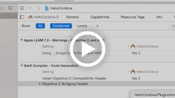

# IBM Bluemix Mobile Services - Cordova Plugin Push SDK

Cordova Plugin for the IBM Bluemix Mobile Services Push SDK

## Installation

### Installing necessary libraries

You should already have Node.js/npm and the Cordova package installed. If you don't, you can download and install Node from [https://nodejs.org/en/download/](https://nodejs.org/en/download/).

The Cordova library is also required to use this plugin. You can find instructions to install Cordova and set up your Cordova app at [https://cordova.apache.org/#getstarted](https://cordova.apache.org/#getstarted).

## Video tutorials 

Below videos demonstrate how to install and use the Cordova Plugin for the IBM Bluemix Mobile Services Push SDK in iOS and Android applications. 

<a href="https://www.youtube.com/watch?v=YugImB6QB08" target="_blank">

</a>
<a href="https://www.youtube.com/watch?v=vm5RsGUA5Gs" target="_blank">

</a>

## Installing the Cordova Plugin for Bluemix Mobile Services Push SDK

### Creating a Cordova application

1. Run the following commands to create a new Cordova application. Alternatively you can use an existing application as well. 

	```Bash
	cordova create {your_app_name}
	cd {your_app_name}
	```
	
1. Edit `config.xml` file and set the desired application name in the `<name>` element instead of a default HelloCordova.

1. Continue editing `config.xml`. Update the `<platform name="ios">` element with a deployment target declaration as shown in the code snippet below.

	```XML
	<platform name="ios">
		<preference name="deployment-target" value="8.0" />
		<!-- add deployment target declaration -->
	</platform>
	```
	
1. Continue editing `config.xml`. Update the `<platform name="android">` element with a minimum and target SDK versions as shown in the code snippet below.

	```XML
	<platform name="android">
		<preference name="android-minSdkVersion" value="15" />
		<preference name="android-targetSdkVersion" value="23" />
		<!-- add minimum and target Android API level declaration -->
	</platform>
	```

	> The minSdkVersion should be above 15.
	
	> The targetSdkVersion should always reflect the latest Android SDK available from Google.

### Adding Cordova platforms

Run the following commands according to which platform you want to add to your Cordova application

```Bash
cordova platform add ios

cordova platform add android
```

### Adding the Cordova plugin

From your Cordova application root directory, enter the following command to install the Cordova Push plugin.

```Bash
cordova plugin add ibm-mfp-push
```

This also installs the Cordova Core plug-in, which initializes your connection to Bluemix.

From your app root folder, verify that the Cordova Core and Push plugin were installed successfully, using the following command.

```Bash
cordova plugin list
```

## Configuration

### Configuring Your iOS Development Environment

1. Follow the `Configuring Your iOS Development Environment` instructions from [Bluemix Mobile Services Core SDK plugin](https://github.com/ibm-bluemix-mobile-services/bms-clientsdk-cordova-plugin-core#configuration) 

1. Uncomment the following Push import statements in your bridging header. Go to `[your-project-name]/Plugins/ibm-mfp-core/Bridging-Header.h`:

```Objective-C
//#import <IMFPush/IMFPush.h>
//#import <IMFPush/IMFPushClient.h>
//#import <IMFPush/IMFResponse+IMFPushCategory.h>
```

<!---
Verify that the Push SDK was added. Go to `Build Settings` > `Search Paths` > `Framework Search Paths` and verify that the following entry was added:

```
"[your-project-name]/Plugins/ibm-mfp-push"
```
-->

#### Updating your client application to use the Push SDK

By default, Cordova creates a native iOS project built with iOS, therefore you will need to import an automatically generated Swift header to use the Push SDK. Add the following Objective-C code snippets to your application delegate class.

At the top of your AppDelegate.m:

```Objective-C
#import "[your-project-name]-Swift.h"
```
    
If your project name has spaces or hyphens, replace them with underscores in the import statement. Example:

```Objective-C
// Project name is "Test Project" or "Test-Project"
#import "Test_Project-Swift.h"
```

Add the code below to your application delegate

#### Objective-C:

```Objective-C
// Register device token with Bluemix Push Notification Service
- (void)application:(UIApplication *)application
	 didRegisterForRemoteNotificationsWithDeviceToken:(NSData *)deviceToken{

	 [[CDVMFPPush sharedInstance] didRegisterForRemoteNotifications:deviceToken];
}
    
// Handle error when failed to register device token with APNs
- (void)application:(UIApplication*)application
	 didFailToRegisterForRemoteNotificationsWithError:(NSError*)error {

	[[CDVMFPPush sharedInstance] didFailToRegisterForRemoteNotifications:error];
}
    
// Handle receiving a remote notification
-(void)application:(UIApplication *)application 
	didReceiveRemoteNotification:(NSDictionary *)userInfo 
	fetchCompletionHandler:(void (^)(UIBackgroundFetchResult))completionHandler {

	[[CDVMFPPush sharedInstance] didReceiveRemoteNotification:userInfo];
}
```

#### Swift:

```Swift
// Register device token with Bluemix Push Notification Service
func application(application: UIApplication, 
	didRegisterForRemoteNotificationsWithDeviceToken deviceToken: NSData) {

	CDVMFPPush.sharedInstance().didRegisterForRemoteNotifications(deviceToken)
}

// Handle error when failed to register device token with APNs
func application(application: UIApplication, 
	didFailToRegisterForRemoteNotificationsWithError error: NSErrorPointer) {
        
	CDVMFPPush.sharedInstance().didFailToRegisterForRemoteNotifications(error)
}
    
// Handle receiving a remote notification
func application(application: UIApplication, 
	didReceiveRemoteNotification userInfo: [NSObject : AnyObject], 	fetchCompletionHandler completionHandler: ) {
	
	CDVMFPPush.sharedInstance().didReceiveRemoteNotification(userInfo)
}
```

### Configuring Your Android Development Environment

Android development environment does not require any additional configuration. You can open the Android Project generated by Cordova in [your-app-name]/platforms/android directory with Android Studio or use Cordova CLI to build and run it.

## Usage

The following MFPPush Javascript functions are available:

Javascript Function | Description
--- | ---
registerDevice(settings, success, failure) | Registers the device with the Push Notifications Service.
unregisterDevice(success, failure) | Unregisters the device from the Push Notifications Service
retrieveSubscriptions(success, failure) | Retrieves the tags device is currently subscribed to
retrieveAvailableTags(success, failure) | Retrieves all the tags available in a push notification service instance.
subscribe(tag, success, failure) | Subscribes to a particular tag.
unsubscribe(tag, success, failure) | Unsubscribes from a particular tag.
registerNotificationsCallback(callback) | Registers a callback for when a notification arrives on the device.

**Android (Native)**
The following native Android function is available.

 Android function | Description
--- | ---
CDVMFPPush. setIgnoreIncomingNotifications(boolean ignore) | By default, push notifications plugin handles all incoming Push Notification by tunnelling them to JavaScript callback. Use this method to override the plugin's default behavior in case you want to manually handle incoming push notifications in native code. 

## Sequence Diagrams


## Examples

### Using MFPPush

#### Register for Push Notifications

```Javascript
var settings = {
	ios: {
		alert: true,
		badge: true,
		sound: true
	}
}
    
var success = function(message) { console.log("Success: " + message); };
var failure = function(message) { console.log("Error: " + message); };
    
MFPPush.registerDevice(settings, success, failure);
```

The settings structure contains the settings that you want to enable for push notifications. You must use the defined structure and should only change the boolean value of each notification setting.

> Android does NOT make use of the settings parameter. If you're only building Android app, pass an empty object, e.g.
    
```Javascript
MFPPush.registerDevice({}, success, failure);
```

To unregister for push notifications, simply call the following:

```Javascript
MFPPush.unregisterDevice(success, failure);
```
    
#### Retrieving Tags

In the following examples, the function parameter is a success callback that receives an array of tags. The second parameter is a callback function called on error.

To retrieve an array of tags to which the user is currently subscribed, use the following Javascript function:

```Javascript
MFPPush.retrieveSubscriptions(function(tags) {
	alert(tags);
}, failure);
```
    
To retrieve an array of tags that are available to subscribe, use the following Javascript function:

```Javascript
MFPPush.retrieveAvailableTags(function(tags) {
	alert(tags);
}, failure);
```
    
#### Subscribe and Unsubscribe to/from Tags

```Javascript
var tag = "YourTag";
MFPPush.subscribe(tag, success, failure);
MFPPush.unsubscribe(tag, success, failure);
```
    
### Receiving a Notification

```Javascript
var handleNotificationCallback = function(notification) {
	// notification is a JSON object
	alert(notification.message);
}

MFPPush.registerNotificationsCallback(handleNotificationCallback);
```

The following table describes the properties of the notification object:

Property | Description
--- | ---
message | Push notification message text
payload | JSON object containing additional notification payload.
sound | The name of a sound file in the app bundle or in the Library/Sounds folder of the app’s data container (iOS only).
badge | The number to display as the badge of the app icon. If this property is absent, the badge is not changed. To remove the badge, set the value of this property to 0 (iOS only).
action-loc-key | The string is used as a key to get a localized string in the current localization to use for the right button’s title instead of “View” (iOS only).

Example Notification structure:

```Javascript
// iOS
notification = {
	message: "Something has happened",
	payload: {
		customProperty:12345
	},
	sound: "mysound.mp3",
	badge: 7,
	action-loc-key: "Click me"
}

// Android
notification = {
	message: "Something has happened",
	payload: {
		customProperty:12345
	},
	id: <id>,
	url: <url>
}
```

## Release Notes

Copyright 2015 IBM Corp.

Licensed under the Apache License, Version 2.0 (the "License"); you may not use this file except in compliance with the License. You may obtain a copy of the License at

http://www.apache.org/licenses/LICENSE-2.0

Unless required by applicable law or agreed to in writing, software distributed under the License is distributed on an "AS IS" BASIS, WITHOUT WARRANTIES OR CONDITIONS OF ANY KIND, either express or implied. See the License for the specific language governing permissions and limitations under the License.
